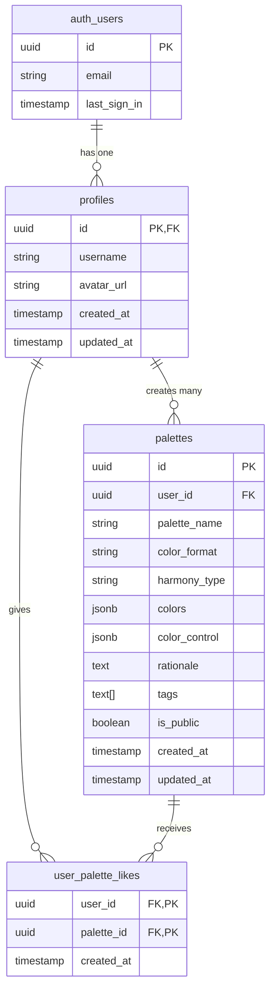

# Color Genius AI - Design Document (implementation-aligned)

## 1. Context

This document describes the current, implemented behavior of the Color Genius AI project. It focuses on the code that is present in this repository (as of the current branch): the Next.js API route that calls an AI generator, the in-repo AI prompt/schema, the types used by the frontend, and the color conversion utilities. The goal is to keep this doc aligned with the code so maintainers and contributors have a correct mental model.

High level summary:

- The backend is implemented as a Next.js API route at `app/api/generate-palette/route.ts`.
- AI generation is performed by a local `PaletteGenerator` (in `utils/ai/palette-generator.ts`) which uses the `ai` SDK + Google model (`gemini-2.0-flash-exp`).
- The AI output is validated with Zod schemas and includes color objects with `name`, `hex`, and `hsl` fields plus a `rationale` and `tags`.
- The API returns a compact palette shape expected by the frontend: an `id`, an array of `{ color, name }` items, and `metadata` (prompt, harmony, rationale, tags, provider/model info).
- Color math utilities in `utils/color-conversions/code-color-conversions.ts` are HSL-focused (hex<->HSL, hex->RGB, and helpers for formatting).

Environment requirement:

- `GOOGLE_GENERATIVE_AI_API_KEY` must be set. The API route checks for this variable and returns a 500 with a helpful message when it's absent.

## 2. Implemented Architecture (concise)

Client -> POST /api/generate-palette -> Next.js route -> PaletteGenerator (AI) -> Zod validation -> Response to client

- No external ColorEngine/OKLCH processing step is invoked by the current API route. The palette generator returns colors already containing HSL and HEX values. The frontend receives a simplified `ColorItem` array (see types section).

## 3. Implementation details (files & behavior)

### API route: `app/api/generate-palette/route.ts`

- Validates incoming requests using Zod. Expected body fields:
  - `prompt` (string, 3..200 chars)
  - `harmony` (one of the supported harmony strings)
  - `colorCount` (number, 3..8, defaults to 5)
- If `GOOGLE_GENERATIVE_AI_API_KEY` is not set the route returns status 500 with an informative JSON message.
- The route instantiates `new PaletteGenerator()` and calls `generatePalette(prompt, harmony, colorCount)`.
- It maps the AI response into the frontend-friendly shape:
  {
  id: <uuid>,
  colors: [ { color: <hex>, name: <string> }, ... ],
  metadata: { prompt, harmony, rationale, tags, generatedAt, model, provider }
  }
- Validation errors (Zod) return 400 with details; other errors return 500.

### AI integration: `utils/ai/palette-generator.ts`

- Uses the `ai` SDK's `generateObject` function with the Google model `gemini-2.0-flash-exp` (`@ai-sdk/google`).
- Enforces a strong Zod schema for the AI output. The implemented schema requires each color object to contain:
  - `name` (2..30 chars)
  - `hex` (string matching /^#[0-9A-Fa-f]{6}$/)
  - `hsl` object ({ h: 0..360, s: 0..100, l: 0..100 })
- Also requires `rationale` (50..300 chars) and `tags` (3..8 strings).
- The generator sanitizes user input to reduce prompt injection risk (removes role labels, code blocks, angle brackets, markdown links, and truncates).
- The system prompt the generator sends to the model contains explicit rules for harmony, spacing, diversity, and output format. Harmony types supported in the generator include: `monochromatic`, `analogous`, `complementary`, `triadic`, `tetradic`, and `split-complementary`.
- On error, the generator returns a deterministic fallback palette (static colors + metadata) so the API can still respond.

### Types: `types/palette.ts` (current implementation)

- HarmonyType (string union):
  - 'analogous'
  - 'complementary'
  - 'triadic'
  - 'monochromatic'
  - 'split-complementary'
  - 'tetradic'
- `HARMONY_TYPES` constant used by the UI to render options.
- `ColorItem` interface returned by the API route:
  - `color: string` (hex, e.g. `#AABBCC`)
  - `name: string`
- `Format` type used in utilities: `'HEX' | 'RGB'`

Note: The repository does not currently expose the richer `Palette` shape (OKLCH, accessibility fields, adjustments, persistence flags) shown in older design drafts — those shapes are not present in the saved `types/palette.ts`.

### Color conversions: `utils/color-conversions/code-color-conversions.ts`

Implemented helpers (summary):

- `hexToHSL(hex)` — converts `#RRGGBB` to HSL { hue, saturation, lightness } with hue in degrees and S/L in percentages.
- `hslToHex(h, s, l)` — converts HSL back to `#RRGGBB`.
- `hexToRgb(hex)` — converts hex to an `rgb(r, g, b)` string.
- `getColorValues(colorItem, format)` — helper that normalizes a color `name` (slugifies) and returns either the uppercase `HEX` or `rgb(...)` string depending on `format`.

These utilities are HSL-centric and intentionally simple — they are what the UI and the PaletteGenerator expect.

## 4. API response shape (concrete example)

POST /api/generate-palette -> 200 OK

Response body example:

{
"id": "b3f1c9f0-...",
"colors": [
{ "color": "#667EEA", "name": "Purple Dawn" },
{ "color": "#764BA2", "name": "Deep Violet" },
{ "color": "#F093FB", "name": "Pink Mist" }
],
"metadata": {
"prompt": "sunset gradient with moody purples",
"harmony": "analogous",
"rationale": "A beautiful gradient palette with purple and pink tones, perfect for modern web designs.",
"tags": ["gradient","purple","pink","modern","elegant"],
"generatedAt": "2025-10-12T...Z",
"model": "gemini-2.0-flash-exp",
"provider": "google"
}
}

## 5. Security & operational notes

- The route checks for `GOOGLE_GENERATIVE_AI_API_KEY`. If you plan to run locally, set this env var (e.g., in `.env.local`) before calling the endpoint.
- The generator sanitizes inputs and enforces a strict output schema via Zod — this reduces the chance of malformed output and prompt-injection-style issues.
- The AI call is wrapped in a try/catch; on failure a static fallback palette is returned. This keeps the API stable for the frontend.

## 6. Differences vs. older design drafts (why this doc changed)

- Older drafts referenced a separate ColorEngine using OKLCH conversions, accessibility calculations (WCAG), and Supabase function invocation for the AI step. The current implementation:
  - Calls `PaletteGenerator` directly from the Next.js route (no Supabase function invocation).
  - Uses HSL/HEX in the AI schema and color utilities (no OKLCH conversion pipeline in the repository code).
  - Returns a compact `ColorItem[]` to the frontend instead of a very rich `Palette` object with adjustments/visibility fields.

If we want to restore the richer pipeline (OKLCH, accessibility checks, persistence, or Move AI invocation into a serverless function), that should be a separate implementation task with its own changes.

## 7. Next steps (suggestions)

- If you want the documentation to also include the full Zod schemas and the exact system prompt text, we can extract and embed them (they are present in `utils/ai/palette-generator.ts`).
- If you want the project to perform OKLCH-based perceptual edits and accessibility checks, we should create a dedicated `ColorEngine` module and adapt the API route to call it.

---

## 8. Database Implementation

### Database Architecture Overview

The application uses Supabase for data persistence with a focus on simplicity and performance. The database design follows a straightforward model with two main tables: `profiles` and `palettes`. The choice of using JSONB for color and control data maintains flexibility while providing good query performance.



### Schema Definition

```sql
-- Profiles table (extends Supabase auth.users)
CREATE TABLE color_genius_ai.profiles (
    id uuid references auth.users primary key,
    username text unique,
    avatar_url text,
    created_at timestamp with time zone default timezone('utc'::text, now()),
    updated_at timestamp with time zone
);

-- Palettes table
CREATE TABLE color_genius_ai.palettes (
    id uuid primary key default gen_random_uuid(),
    user_id uuid references color_genius_ai.profiles not null,
    palette_name text not null,
    color_format text not null,
    harmony_type text not null,
    colors jsonb not null,
    color_control jsonb not null,
    rationale text,
    tags text[] not null,
    is_public boolean not null default false,
    created_at timestamp with time zone default timezone('utc'::text, now()),
    updated_at timestamp with time zone,
    
    constraint valid_colors check (jsonb_array_length(colors) between 3 and 8),
    constraint valid_color_control check (
        color_control ? 'brightness' and 
        color_control ? 'saturation' and 
        color_control ? 'warmth'
    )
);

-- Indexes for performance
CREATE INDEX idx_palettes_user_id ON palettes(user_id);
CREATE INDEX idx_palettes_tags ON palettes USING gin(tags);

-- User Palette Likes table (tracks likes/favorites on public palettes)
CREATE TABLE color_genius_ai.user_palette_likes (
    user_id uuid NOT NULL,
    palette_id uuid NOT NULL,
    created_at timestamp with time zone NOT NULL DEFAULT timezone('utc'::text, now()),

    -- Composite primary key prevents duplicate likes for the same user-palette pair
    CONSTRAINT user_palette_likes_pk PRIMARY KEY (user_id, palette_id),

    -- Foreign keys with cascading deletes
    CONSTRAINT fk_like_user FOREIGN KEY (user_id)
        REFERENCES color_genius_ai.profiles (id) ON DELETE CASCADE,

    CONSTRAINT fk_like_palette FOREIGN KEY (palette_id)
        REFERENCES color_genius_ai.palettes (id) ON DELETE CASCADE
);

-- Index for efficient lookup of palettes liked by a user
CREATE INDEX idx_user_palette_likes_user_id ON color_genius_ai.user_palette_likes(user_id);
-- Index for efficient lookup of likes on a palette
CREATE INDEX idx_user_palette_likes_palette_id ON color_genius_ai.user_palette_likes(palette_id);
```

### Row Level Security Policies

```sql
-- Enable RLS
ALTER TABLE color_genius_ai.profiles ENABLE ROW LEVEL SECURITY;
ALTER TABLE color_genius_ai.palettes ENABLE ROW LEVEL SECURITY;

-- color_genius_ai.profiles policies
CREATE POLICY "Users can view own profile" 
    ON color_genius_ai.profiles FOR SELECT 
    USING (auth.uid() = id);

CREATE POLICY "Users can update own profile" 
    ON color_genius_ai.profiles FOR UPDATE 
    USING (auth.uid() = id);

-- color_genius_ai.color_genius_ai.palettes policies
CREATE POLICY "Users can view own color_genius_ai.color_genius_ai.palettes" 
    ON color_genius_ai.palettes FOR SELECT 
    USING (auth.uid() = user_id);

CREATE POLICY "Anyone can view public color_genius_ai.palettes" 
    ON color_genius_ai.palettes FOR SELECT 
    USING (is_public = true);

CREATE POLICY "Users can insert own color_genius_ai.palettes" 
    ON color_genius_ai.palettes FOR INSERT 
    WITH CHECK (auth.uid() = user_id);

CREATE POLICY "Users can update own color_genius_ai.palettes" 
    ON color_genius_ai.palettes FOR UPDATE 
    USING (auth.uid() = user_id);

CREATE POLICY "Users can delete own color_genius_ai.palettes" 
    ON color_genius_ai.palettes FOR DELETE
    USING (auth.uid() = user_id);

-- color_genius_ai.user_palette_likes policies
ALTER TABLE color_genius_ai.user_palette_likes ENABLE ROW LEVEL SECURITY;

CREATE POLICY "Anyone can view likes on public palettes" 
    ON color_genius_ai.user_palette_likes FOR SELECT 
    USING (
        EXISTS (
            SELECT 1 FROM color_genius_ai.palettes p
            WHERE p.id = palette_id AND p.is_public = true
        )
    );

CREATE POLICY "Authenticated users can insert likes" 
    ON color_genius_ai.user_palette_likes FOR INSERT 
    WITH CHECK (auth.uid() = user_id);

CREATE POLICY "Users can delete their own likes" 
    ON color_genius_ai.user_palette_likes FOR DELETE 
    USING (auth.uid() = user_id);
```

### Performance Considerations

1. **JSONB Storage**
   - Colors and controls stored as JSONB for flexibility
   - Indexed visibility field for public palette queries
   - GIN index on tags for fast tag searches

2. **Query Optimization**
   - User_id index for fast user palette retrieval
   - Visibility condition pushed to index scan
   - Array overlap operator (&&) for efficient tag searches

3. **Data Integrity**
   - Check constraints ensure valid color arrays
   - Check constraints validate control object structure
   - Foreign key constraints maintain referential integrity

### Migration Strategy

The schema supports future extensions through:
- JSONB fields for flexible color and control data
- Array type for tags allowing easy additions
- Visibility JSONB object for extended privacy controls

This document has been updated to reflect the code currently present in the repository. If you want me to also align other docs, tests, or add a short README snippet showing how to run the API locally (env vars to set), tell me and I will add it.

### Authentication and Authorization Model

- **Supabase Auth Integration**: Google OAuth
- **Row-Level Security**: Palettes accessible only to creators
- **JWT-based sessions**: Stateless authentication with automatic token refresh
- **Role-based access**: Basic user role with optional premium features

### Input Validation and Sanitization

````typescript
// Comprehensive validation schemas
const PromptSchema = z
  .string()
  .min(3, 'Prompt too short')
  .max(200, 'Prompt too long')
  .regex(/^[a-zA-Z0-9\s\-,.!?]+$/, 'Invalid characters');

const HarmonySchema = z.enum(['monochromatic', 'analogous', 'complementary', 'triadic', 'tetradic']);

const ColorSchema = z.string().regex(/^#[0-9A-Fa-f]{6}$/, 'Invalid hex color');

// AI-specific input sanitization
function sanitizeAIPrompt(prompt: string): string {
  if (!prompt || typeof prompt !== 'string') {
    throw new Error('Invalid input: must be a non-empty string');
  }

  return prompt
    .trim()
    .replace(/[<>\"'`{}]/g, '') // Remove potential injection characters
    .replace(/\b(system|assistant|user):/gi, '') // Remove role indicators
    .replace(/```[\s\S]*?```/g, '') // Remove code blocks
    .replace(/\[.*?\]\(.*?\)/g, '') // Remove markdown links
    .replace(/javascript:|data:|vbscript:/gi, '') // Remove potential XSS vectors
    .substring(0, 200); // Limit length
}

// Output validation for AI responses
function validateAIOutput(output: any): boolean {
  const schema = z.object({
    colors: z
      .array(z.string().regex(/^#[0-9A-Fa-f]{6}$/))
      .min(3)
      .max(8),
    names: z.array(z.string().min(1).max(30)),
    rationale: z.string().min(10).max(300),
    tags: z.array(z.string()).min(1).max(10),
  });

  try {
    schema.parse(output);
    return true;
  } catch {
    return false;
  }
}
````

### Threats, Risks, and Mitigations

| Threat                         | Risk Level | Mitigation                                                                   |
| ------------------------------ | ---------- | ---------------------------------------------------------------------------- |
| **AI Prompt Injection**        | High       | Multi-layer sanitization, role indicator removal, structured output with Zod |
| **API Key Exposure**           | Critical   | Environment variables in Supabase Edge Functions, never client-side          |
| **AI Output Manipulation**     | High       | Schema validation, output sanitization, fallback mechanisms                  |
| **Rate Limiting Bypass**       | Medium     | IP-based throttling, Supabase built-in limits, cost monitoring               |
| **Model Hallucination**        | Medium     | Structured JSON output, confidence scoring, manual validation                |
| **Cost Exploitation**          | Medium     | Request limits, token counting, provider fallback chain                      |
| **Cross-site Scripting (XSS)** | Medium     | Content Security Policy, React built-in protection, output encoding          |
| **Data Exfiltration**          | Low        | RLS policies, minimal logging, no prompt storage                             |
| **Dependency Vulnerabilities** | Low        | Regular updates, security scanning, minimal AI SDK dependencies              |

## 5. Non-functional Requirements

### Performance Targets

- **AI Palette Generation**: < 3 seconds end-to-end (GPT-4o mini typically: 1-2 seconds)
- **Color Adjustments**: < 100ms response time (client-side OKLCH processing)
- **Export Operations**: < 500ms for all formats
- **Page Load Time**: < 2 seconds for initial render
- **Bundle Size**: < 500KB initial JavaScript bundle
- **Fallback Response**: < 50ms for static palettes when AI fails

### Availability and Fault Tolerance

- **Uptime Target**: 99.9% availability
- **Graceful Degradation**: Offline color adjustments when API unavailable
- **Fallback Mechanisms**: Pre-generated color suggestions if AI fails
- **Error Recovery**: Automatic retry with exponential backoff

### Observability

```typescript
// Metrics and monitoring
interface PaletteMetrics {
  generationTime: number;
  colorCount: number;
  harmonyType: string;
  adjustmentFrequency: number;
  exportFormat: string;
}

// Error tracking
class PaletteError extends Error {
  constructor(message: string, public code: string, public context: Record<string, any>) {
    super(message);
  }
}
```

- **Performance Monitoring**: Vercel Analytics + custom timing metrics
- **Error Tracking**: Sentry integration for client and server errors
- **Usage Analytics**: Privacy-focused metrics (no prompt content stored)
- **Health Checks**: API endpoint monitoring and alerting

## 6. Tasks and Estimates

### Epic 1: Core Infrastructure (15 story points)

**Task 1.1: Project Setup and Configuration** (3 points)

- Initialize Next.js 15 with TypeScript
- Configure Supabase client and environment variables
- Set up Redux Toolkit with persistence
- Configure Tailwind CSS and component library

_Acceptance Criteria:_

- Project builds successfully with no TypeScript errors
- Supabase connection established and authenticated
- Redux store configured with proper TypeScript typing

**Task 1.2: Color Engine Development** (8 points)

- Implement OKLCH color space conversions
- Build harmony validation algorithms
- Create accessibility checking functions
- Develop color adjustment utilities

_Acceptance Criteria:_

- All color space conversions accurate within 1% tolerance
- Harmony validation covers 5+ harmony types
- WCAG contrast calculations match reference implementations
- Color adjustments feel natural and predictable

**Task 1.3: Database Schema and API Foundation** (4 points)

- Design and implement Supabase schema
- Set up Row-Level Security policies
- Create basic API routes structure
- Implement authentication flow

_Acceptance Criteria:_

- Database schema supports all planned features
- RLS policies prevent unauthorized access
- API routes follow consistent patterns and error handling

### Epic 2: AI Integration and Palette Generation (11 story points)

**Task 2.1: AI Integration with Vercel AI SDK** (4 points)

- Implement PaletteGenerator class using Vercel AI SDK and GPT-4o mini
- Set up structured JSON output using Zod schemas with `generateObject`
- Add comprehensive input sanitization and prompt injection protection
- Implement static fallback mechanism for API failures

_Acceptance Criteria:_

- PaletteGenerator produces valid JSON 95% of the time with structured output
- Input sanitization prevents prompt injection attacks
- Static fallbacks work when OpenAI API is unavailable

**Task 2.2: Secure Prompt Engineering** (3 points)

- Design security-first prompts that prevent injection
- Create systematic prompt templates with validation
- Implement confidence scoring and output validation
- Add fallback static palettes for error scenarios

_Acceptance Criteria:_

- Generated palettes meet harmony requirements 90% of the time
- Color names are semantically meaningful and contextually appropriate
- AI rationales provide useful design insights

### Epic 3: User Interface Development (21 story points)

#### Task 3.1: Main Palette Generator Component (6 points)

- Build prompt input interface with harmony selection
- Create loading states and error handling
- Implement palette display with color swatches
- Add basic export functionality

_Acceptance Criteria:_

- Intuitive user interface with clear visual hierarchy
- Real-time validation feedback on user input
- Responsive design works on mobile and desktop

#### Task 3.2: Color Visualization Components (4 points)

- Build interactive color wheel display
- Create color contrast visualization tools

_Acceptance Criteria:_

- Color wheel accurately represents hue relationships
- Accessibility badges show correct WCAG levels

#### Task 3.3: Perceptual Control Sliders (4 points)

- Implement brightness, saturation, and warmth sliders
- Create visual feedback for slider adjustments
- The colors in the color wheel should also reflect the changes made by the sliders
- The adjustments made in the color wheel by the user dragging the color, should reflect with the preview taking into consideration the Palette controls (brightness, saturation, and warmth) configurations

_Acceptance Criteria:_

- Slider adjustments feel immediate (< 100ms response)
- Visual changes correspond to perceptual expectations

#### Task 3.4: Export and Sharing Features (3 points)

- Build copy-to-clipboard for multiple formats
- Create shareable palette URLs
- Implement palette saving with visibility settings (disabled by default)
- Add export format preferences

_Acceptance Criteria:_

- Export formats (Tailwind, CSS, etc.) are syntactically correct
- Shareable URLs reconstruct palettes accurately
- User preferences persist across sessions
- Visibility settings allow users to control palette privacy and explore visibility


#### Task 3.5: Profile Module (3 story points)

- Sidebar: user profile area and sign-out flow with confirmation dialog have been implemented in the app UI.
- Alert dialog (shadcn / Radix-based) was integrated and is used for destructive and confirmation flows (palette deletion, sign-out).
- Dashboard: the palettes list and per-palette actions (toggle visibility, delete with confirmation, download placeholder) are implemented and wired to the API/actions.

#### Task 3.6: Profile Module (3 story points)

Add a small profile editing module that allows authenticated users to update their full name and upload a new avatar image. This is a focused UI/API task that improves account management UX.

Key items

- Update `profiles.username` (or `full_name`) with a simple form input.
- Upload avatar images to a Supabase storage bucket (e.g. `avatars/{userId}/{timestamp}-{filename}`) and update `profiles.avatar_url` with the returned URL or signed URL.
- Provide client-side validation (file type/size), loading states, and success/error feedback.

Acceptance criteria

- Profile edit UI exists and updates the DB without a full page reload.
- Avatar uploads use Supabase Storage API and update the profile record atomically.
- UI reflects the new name and avatar immediately after a successful update.

Estimated effort

- 1–2 days (frontend form, Supabase Storage upload wiring, DB update, and basic validation/UX)

#### Task 3.7: Palette Liking System and Public Discovery (5 story points)

- Implement like/favorite functionality for public palettes
- Add like count display on palette cards
- Create user's liked palettes collection view
- Build API routes for like/unlike operations
- Add like animations and feedback UI

_Acceptance Criteria:_

- Users can like/unlike public palettes from other creators
- Like counts update in real-time on palette cards
- Liked palettes are tracked in user's profile
- Unauthenticated users can browse but cannot like
- Like operations are idempotent and handle concurrent requests
- Database maintains referential integrity with cascading deletes

#### Task 3.8: Explore Section and Discovery (4 points)

- Build public palette browsing interface
- Implement tag-based filtering and search
- Add pagination and infinite scroll
- Create palette discovery algorithms using tags
- Display like counts and trending palettes

_Acceptance Criteria:_

- Only palettes marked as public and show in explore are visible
- Tag filtering works efficiently with large datasets
- Search functionality finds relevant palettes quickly
- Discovery algorithms surface interesting and diverse palettes
- Trending/popular palettes (by like count) are highlighted

**Total Estimate: 52 story points (approximately 10-11 weeks with 1 developer)**


## 7. Open Questions and Decisions to Confirm

### Technical Decisions

1. **LLM Provider Selection**: Simplified AI SDK approach selected

   - **Single Provider**: GPT-4o mini via OpenAI API (cost-effective at $0.15/1M tokens)
   - **Architecture**: Vercel AI SDK with `generateObject` for structured JSON
   - **Fallback Strategy**: Static palette fallbacks on API failures
   - **Security**: Input sanitization, Zod schema validation, rate limiting

2. **Color Space Library**: Should we build OKLCH conversion in-house or use a library?

   - In-house: Full control, smaller bundle size
   - Library (culori): Battle-tested, comprehensive, but larger bundle

3. **Real-time Updates**: WebSocket connections for live collaboration?
   - Current scope: Single-user palette editing
   - Future: Multi-user collaborative palette creation

### UX/Design Questions

4. **Default Color Count and Font**: What's the optimal default palette size?

   - Colors:
   - Primary: #AAD291
   - Secondary: #BDCBB0
   - Tertiary: #A0CFCF
   - Error: #FFB4AB
   - Neutral: #E1E4D9
   - Neutral Variant: #C3C8BB
   - Background: #1A1C19
   - Font: Space Grotesk

5. **Mobile Interaction Model**: How should sliders work on touch devices?

   - Options: Native sliders, custom gesture controls, tap-to-adjust

6. **Export Format Priority**: Which export formats are most important for MVP?
   - Confirmed: Tailwind CSS, CSS variables
   - Consider: Sass variables, Adobe ASE, Figma tokens

### Business Logic Clarifications

7. **Palette Saving and Visibility Model**: How should palette persistence work?

   - **Free Users**: Basic generation, export, temporary browser storage
   - **Authenticated Users**: Optional palette saving (disabled by default)
   - **Visibility Settings**: Users can opt-in to:
     - Save palette to their account (`isSaved: true`)
     - Make palette public (`isPublic: true`)
     - Show in explore section (`showInExplore: true`)
   - **Default Behavior**: All visibility flags start as `false` to respect user privacy

8. **Rate Limiting Strategy**: How to balance user experience with cost control?

   - Options: Per-IP limits, user-based quotas, progressive rate limiting

9. **Data Retention Policy**: How long should we store palettes and user data?
   - User palettes: Until account deletion

### Integration Concerns

10. **AI Provider Dependencies**: Simplified single provider approach

    - **Single Provider**: Gemini (reliable, cost-effective at $0.15/1M tokens)
    - **Fallback Strategy**: Static pre-generated palettes for API failures
    - **Monitoring**: Track success rates, response times, and costs
    - **Reliability**: 99%+ uptime expected from OpenAI infrastructure

11. **Environment Variables Management**:

    ```bash
    GOOGLE_GENERATIVE_AI_API_KEY=sk-proj-xxx           # Gemini API key
    SUPABASE_ENVS
    ```

12. **Third-party Dependencies**: Risk assessment for critical libraries?
    - **AI Libraries**: Vercel AI SDK (actively maintained, TypeScript-first)
    - **Color Libraries**: Culori for OKLCH conversions (battle-tested)
    - **Validation**: Zod for runtime type safety (essential for AI outputs)
  - **Contingency**: All dependencies have fallback implementations
