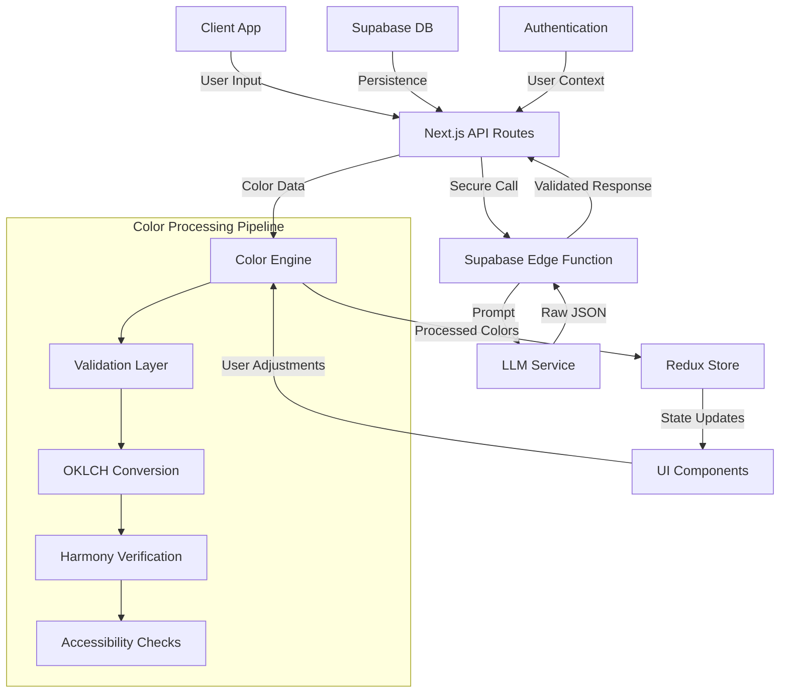
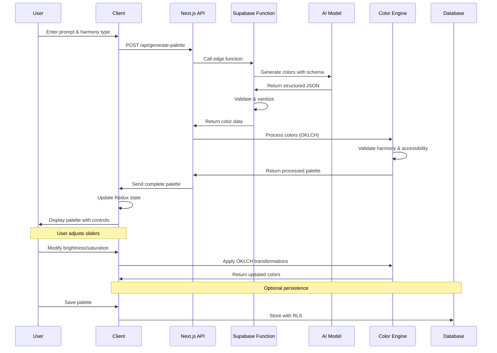

# Color Genius AI - Design Document

## 1. Context

Color Genius AI is an AI-first application that generates comprehensive, web-ready color palettes from natural language descriptions. The system provides complete creative packages including HEX codes, semantic color names, design rationales, and categorical tags. Built with color science guardrails and perceptual controls, the application ensures generated palettes are both aesthetically pleasing and technically sound for web development.

### Goals and Success Criteria

**Primary Goals:**
- Generate usable, harmonious color palettes from natural language prompts
- Provide complete creative context (names, rationales, tags) alongside colors
- Ensure color science compliance (sRGB gamut, distinctness, harmony rules)
- Enable intuitive color adjustments using perceptual controls
- Export production-ready code snippets for modern web frameworks

**Success Criteria:**
- Generate palettes in under 3 seconds with 95% success rate
- Achieve minimum 4.5:1 WCAG contrast ratio for accessibility badges
- Support 5+ color harmony types (analogous, complementary, triadic, etc.)
- Export formats for Tailwind CSS, CSS variables, and other web formats
- Maintain user session state across interactions

## 2. High-level Solution

### Proposed Architecture



### Key Components and Responsibilities

1. **Client Application (Next.js)**
   - User interface and interaction handling
   - State management via Redux
   - Real-time color adjustments and previews
   - Export functionality for various formats

2. **Color Engine Module**
   - Core color science calculations using OKLCH color space
   - Validation and correction algorithms
   - Harmony rule enforcement
   - Accessibility compliance checks

3. **AI Integration Layer (Supabase Edge Function)**
   - Secure LLM API calls with rate limiting
   - Input/output validation using Zod schemas
   - Error handling and fallback mechanisms

4. **Persistence Layer (Supabase)**
   - User authentication and session management
   - Palette storage with Row-Level Security (RLS)
   - User preferences and history tracking

### High-level Data and Control Flow



## 3. Code and Architectural Changes

### Data Models

#### Core Types

```typescript
// types/color.ts
export interface Color {
  hex: string;
  name: string;
  oklch: {
    l: number; // Lightness (0-1)
    c: number; // Chroma (0-0.4+)
    h: number; // Hue (0-360)
  };
  accessibility: {
    contrastLight: number;
    contrastDark: number;
    wcagLevel: 'AA' | 'AAA' | 'FAIL';
  };
}

// types/palette.ts
export interface Palette {
  id: string;
  colors: Color[];
  metadata: {
    prompt: string;
    harmony: HarmonyType;
    rationale: string;
    tags: string[];
  };
  adjustments: {
    brightness: number; // -1 to 1
    saturation: number; // -1 to 1
    warmth: number;     // -1 to 1
  };
  isPublic: boolean;
  createdAt: Date;
  userId?: string;
}

export type HarmonyType = 
  | 'monochromatic'
  | 'analogous'
  | 'complementary'
  | 'triadic'
  | 'tetradic'
  | 'split-complementary';
```

#### Database Schema (Supabase)

```sql
-- migrations/001_initial_schema.sql
CREATE TABLE palettes (
  id UUID DEFAULT gen_random_uuid() PRIMARY KEY,
  user_id UUID REFERENCES auth.users(id),
  name TEXT NOT NULL,
  colors JSONB NOT NULL,
  metadata JSONB NOT NULL,
  adjustments JSONB DEFAULT '{"brightness": 0, "saturation": 0, "warmth": 0}'::jsonb,
  isPublic BOOLEAN DEFAULT FALSE,
  created_at TIMESTAMP WITH TIME ZONE DEFAULT NOW(),
  updated_at TIMESTAMP WITH TIME ZONE DEFAULT NOW()
);

CREATE TABLE user_preferences (
  user_id UUID REFERENCES auth.users(id) PRIMARY KEY,
  default_harmony TEXT DEFAULT 'analogous',
  preferred_export_format TEXT DEFAULT 'tailwind',
  created_at TIMESTAMP WITH TIME ZONE DEFAULT NOW()
);

-- Row Level Security
ALTER TABLE palettes ENABLE ROW LEVEL SECURITY;
CREATE POLICY "Users can view own palettes" ON palettes FOR SELECT USING (auth.uid() = user_id);
CREATE POLICY "Anyone can view public palettes" ON palettes FOR SELECT USING ((visibility->>'isPublic')::boolean = true);
CREATE POLICY "Users can insert own palettes" ON palettes FOR INSERT WITH CHECK (auth.uid() = user_id);
CREATE POLICY "Users can update own palettes" ON palettes FOR UPDATE USING (auth.uid() = user_id);
```

### Key Code Examples

#### Color Engine Core Module

```typescript
// lib/color-engine/index.ts
import { oklchToHex, hexToOklch } from './oklch';
import { validateHarmony } from './harmony';
import { checkAccessibility } from './accessibility';

export class ColorEngine {
  static processAIPalette(rawColors: string[], harmony: HarmonyType): Color[] {
    return rawColors.map((hex, index) => {
      const oklch = hexToOklch(hex);
      const accessibility = checkAccessibility(hex);
      
      return {
        hex: this.ensureValidHex(hex),
        name: `Color ${index + 1}`, // Will be replaced by AI-generated name
        oklch,
        accessibility
      };
    }).filter(color => this.isValidColor(color));
  }

  static adjustPalette(colors: Color[], adjustments: PaletteAdjustments): Color[] {
    return colors.map(color => {
      const adjusted = {
        l: Math.max(0, Math.min(1, color.oklch.l + adjustments.brightness * 0.3)),
        c: Math.max(0, color.oklch.c * (1 + adjustments.saturation * 0.5)),
        h: (color.oklch.h + adjustments.warmth * 30 + 360) % 360
      };
      
      const hex = oklchToHex(adjusted);
      return {
        ...color,
        hex,
        oklch: adjusted,
        accessibility: checkAccessibility(hex)
      };
    });
  }
}
```

#### API Route Implementation

```typescript
// app/api/generate-palette/route.ts
import { NextRequest, NextResponse } from 'next/server';
import { createClient } from '@supabase/supabase-js';
import { z } from 'zod';
import { ColorEngine } from '@/lib/color-engine';

const GenerateRequestSchema = z.object({
  prompt: z.string().min(3).max(200),
  harmony: z.enum(['monochromatic', 'analogous', 'complementary', 'triadic']),
  colorCount: z.number().min(3).max(8).default(5)
});

export async function POST(request: NextRequest) {
  try {
    const body = await request.json();
    const { prompt, harmony, colorCount } = GenerateRequestSchema.parse(body);
    
    const supabase = createClient(
      process.env.NEXT_PUBLIC_SUPABASE_URL!,
      process.env.SUPABASE_SERVICE_ROLE_KEY!
    );
    
    const { data, error } = await supabase.functions.invoke('generate-palette', {
      body: { prompt, harmony, colorCount }
    });
    
    if (error) throw error;
    
    // Process colors through color engine
    const processedColors = ColorEngine.processAIPalette(data.colors, harmony);
    
    const palette: Palette = {
      id: crypto.randomUUID(),
      colors: processedColors,
      metadata: {
        prompt,
        harmony,
        rationale: data.rationale,
        tags: data.tags,
      },
      adjustments: { brightness: 0, saturation: 0, warmth: 0 },
      visibility: { isPublic: false, isSaved: false, showInExplore: false },
      createdAt: new Date()
    };
    
    return NextResponse.json(palette);
  } catch (error) {
    return NextResponse.json(
      { error: 'Failed to generate palette' },
      { status: 500 }
    );
  }
}
```

#### AI Integration with Vercel AI SDK

```typescript
// lib/ai/palette-generator.ts
import { generateObject } from 'ai';
import { openai } from '@ai-sdk/openai';
import { z } from 'zod';

// Structured output schema for type safety
const PaletteSchema = z.object({
  colors: z.array(z.string().regex(/^#[0-9A-Fa-f]{6}$/)).min(3).max(8),
  names: z.array(z.string().min(2).max(30)),
  rationale: z.string().min(50).max(200),
  tags: z.array(z.string().min(1).max(20)).min(3).max(8),
});

export class PaletteGenerator {
  private model = openai('gpt-4o-mini');

  async generatePalette(prompt: string, harmony: string, colorCount: number = 5) {
    const sanitizedPrompt = this.sanitizeInput(prompt);
    
    try {
      const result = await generateObject({
        model: this.model,
        schema: PaletteSchema,
        messages: [
          { 
            role: 'system', 
            content: this.buildSystemPrompt(harmony, colorCount)
          },
          { 
            role: 'user', 
            content: `Create a ${harmony} color palette for: "${sanitizedPrompt}"`
          }
        ],
        temperature: 0.7,
        maxRetries: 2,
      });

      return {
        ...result.object,
        metadata: {
          provider: 'openai',
          model: 'gpt-4o-mini',
          generatedAt: new Date().toISOString()
        }
      };
    } catch (error) {
      console.error('AI generation failed:', error);
      return this.getStaticFallback();
    }
  }

  private sanitizeInput(input: string): string {
    if (!input || typeof input !== 'string') {
      throw new Error('Invalid input: must be a non-empty string');
    }

    return input
      .trim()
      .replace(/[<>\"'`{}]/g, '') // Remove potential injection characters
      .replace(/\b(system|assistant|user):/gi, '') // Remove role indicators
      .replace(/```[\s\S]*?```/g, '') // Remove code blocks
      .replace(/\[.*?\]\(.*?\)/g, '') // Remove markdown links
      .substring(0, 200); // Limit length
  }

  private buildSystemPrompt(harmony: string, colorCount: number): string {
    const allowedHarmonies = ['monochromatic', 'analogous', 'complementary', 'triadic', 'tetradic'];
    
    if (!allowedHarmonies.includes(harmony)) {
      throw new Error(`Invalid harmony type: ${harmony}`);
    }

    if (colorCount < 3 || colorCount > 8) {
      throw new Error(`Invalid color count: ${colorCount}`);
    }

    return `You are a professional color palette generator. Generate exactly ${colorCount} colors following ${harmony} color harmony principles.

REQUIREMENTS:
- Return valid JSON matching the provided schema exactly
- Use #RRGGBB hex format (6 characters after #)
- Follow ${harmony} color harmony rules strictly
- Provide creative, descriptive color names (2-30 characters)
- Write a design rationale (50-200 characters)
- Add 3-8 relevant tags for discoverability
- Consider web accessibility and modern design trends

The colors should work well together and be suitable for web design projects.`;
  }

  private getStaticFallback() {
    return {
      colors: ['#667eea', '#764ba2', '#f093fb', '#f5576c', '#4facfe'],
      names: ['Purple Dawn', 'Deep Violet', 'Pink Mist', 'Coral Pink', 'Sky Blue'],
      rationale: 'A beautiful gradient palette with purple and pink tones.',
      tags: ['gradient', 'purple', 'pink', 'modern', 'elegant'],
      metadata: {
        provider: 'fallback',
        model: 'static',
        generatedAt: new Date().toISOString()
      }
    };
  }
}
```

#### Supabase Edge Function Implementation

```typescript
// supabase/functions/generate-palette/index.ts
import { PaletteGenerator } from '../../../lib/ai/palette-generator.ts';

const corsHeaders = {
  'Access-Control-Allow-Origin': '*',
  'Access-Control-Allow-Headers': 'authorization, x-client-info, apikey, content-type',
  'Access-Control-Allow-Methods': 'POST, OPTIONS',
};

interface GenerateRequest {
  prompt: string;
  harmony: 'monochromatic' | 'analogous' | 'complementary' | 'triadic' | 'tetradic';
  colorCount?: number;
}

export async function handler(req: Request): Promise<Response> {
  if (req.method === 'OPTIONS') {
    return new Response('ok', { headers: corsHeaders });
  }

  try {
    const { prompt, harmony, colorCount = 5 }: GenerateRequest = await req.json();

    // Input validation
    if (!prompt || typeof prompt !== 'string' || prompt.length < 3 || prompt.length > 200) {
      return new Response(
        JSON.stringify({ error: 'Invalid prompt. Must be 3-200 characters.' }),
        { status: 400, headers: { ...corsHeaders, 'Content-Type': 'application/json' } }
      );
    }

    const allowedHarmonies = ['monochromatic', 'analogous', 'complementary', 'triadic', 'tetradic'];
    if (!allowedHarmonies.includes(harmony)) {
      return new Response(
        JSON.stringify({ error: 'Invalid harmony type.' }),
        { status: 400, headers: { ...corsHeaders, 'Content-Type': 'application/json' } }
      );
    }

    if (colorCount < 3 || colorCount > 8) {
      return new Response(
        JSON.stringify({ error: 'Color count must be between 3 and 8.' }),
        { status: 400, headers: { ...corsHeaders, 'Content-Type': 'application/json' } }
      );
    }

    // Simple rate limiting (can be enhanced with Supabase or Redis)
    const clientIP = req.headers.get('x-forwarded-for') || 'unknown';
    // TODO: Implement proper rate limiting

    // Generate palette using GPT-4o mini
    const generator = new PaletteGenerator();
    const result = await generator.generatePalette(prompt, harmony, colorCount);

    return new Response(JSON.stringify(result), {
      headers: { ...corsHeaders, 'Content-Type': 'application/json' }
    });

  } catch (error) {
    console.error('Generation error:', error);
    
    // Return fallback palette on any error
    const fallback = {
      colors: ['#667eea', '#764ba2', '#f093fb', '#f5576c', '#4facfe'],
      names: ['Purple Dawn', 'Deep Violet', 'Pink Mist', 'Coral Pink', 'Sky Blue'],
      rationale: 'A beautiful gradient palette with purple and pink tones.',
      tags: ['gradient', 'purple', 'pink', 'modern', 'elegant'],
      metadata: { provider: 'error-fallback', model: 'static' }
    };

    return new Response(JSON.stringify(fallback), {
      status: 200, // Return 200 with fallback for better UX
      headers: { ...corsHeaders, 'Content-Type': 'application/json' }
    });
  }
}

Deno.serve(handler);
```

## 4. Security Considerations

### Authentication and Authorization Model

- **Supabase Auth Integration**: OAuth providers (Google, GitHub) + email/password
- **Row-Level Security**: Palettes accessible only to creators
- **JWT-based sessions**: Stateless authentication with automatic token refresh
- **Role-based access**: Basic user role with optional premium features

### Input Validation and Sanitization

```typescript
// Comprehensive validation schemas
const PromptSchema = z.string()
  .min(3, "Prompt too short")
  .max(200, "Prompt too long")
  .regex(/^[a-zA-Z0-9\s\-,.!?]+$/, "Invalid characters");

const HarmonySchema = z.enum(['monochromatic', 'analogous', 'complementary', 'triadic', 'tetradic']);

const ColorSchema = z.string()
  .regex(/^#[0-9A-Fa-f]{6}$/, "Invalid hex color");

// AI-specific input sanitization
function sanitizeAIPrompt(prompt: string): string {
  if (!prompt || typeof prompt !== 'string') {
    throw new Error('Invalid input: must be a non-empty string');
  }

  return prompt
    .trim()
    .replace(/[<>\"'`{}]/g, '') // Remove potential injection characters
    .replace(/\b(system|assistant|user):/gi, '') // Remove role indicators
    .replace(/```[\s\S]*?```/g, '') // Remove code blocks
    .replace(/\[.*?\]\(.*?\)/g, '') // Remove markdown links
    .replace(/javascript:|data:|vbscript:/gi, '') // Remove potential XSS vectors
    .substring(0, 200); // Limit length
}

// Output validation for AI responses
function validateAIOutput(output: any): boolean {
  const schema = z.object({
    colors: z.array(z.string().regex(/^#[0-9A-Fa-f]{6}$/)).min(3).max(8),
    names: z.array(z.string().min(1).max(30)),
    rationale: z.string().min(10).max(300),
    tags: z.array(z.string()).min(1).max(10)
  });

  try {
    schema.parse(output);
    return true;
  } catch {
    return false;
  }
}
```

### Threats, Risks, and Mitigations

| Threat | Risk Level | Mitigation |
|--------|------------|------------|
| **AI Prompt Injection** | High | Multi-layer sanitization, role indicator removal, structured output with Zod |
| **API Key Exposure** | Critical | Environment variables in Supabase Edge Functions, never client-side |
| **AI Output Manipulation** | High | Schema validation, output sanitization, fallback mechanisms |
| **Rate Limiting Bypass** | Medium | IP-based throttling, Supabase built-in limits, cost monitoring |
| **Model Hallucination** | Medium | Structured JSON output, confidence scoring, manual validation |
| **Cost Exploitation** | Medium | Request limits, token counting, provider fallback chain |
| **Cross-site Scripting (XSS)** | Medium | Content Security Policy, React built-in protection, output encoding |
| **Data Exfiltration** | Low | RLS policies, minimal logging, no prompt storage |
| **Dependency Vulnerabilities** | Low | Regular updates, security scanning, minimal AI SDK dependencies |

## 5. Non-functional Requirements

### Performance Targets

- **AI Palette Generation**: < 3 seconds end-to-end (GPT-4o mini typically: 1-2 seconds)
- **Color Adjustments**: < 100ms response time (client-side OKLCH processing)
- **Export Operations**: < 500ms for all formats
- **Page Load Time**: < 2 seconds for initial render
- **Bundle Size**: < 500KB initial JavaScript bundle
- **Fallback Response**: < 50ms for static palettes when AI fails

### Scaling Expectations

- **Concurrent Users**: 1,000+ simultaneous users
- **Daily Requests**: 50,000+ palette generations
- **Database Growth**: 1M+ palettes stored
- **Edge Function Limits**: 10,000 invocations/day (Supabase free tier)
- **AI Cost Management**: 
  - GPT-4o mini: ~$7.50 per 50K generations (extremely budget-friendly)
  - Estimated cost: ~$0.0003 per palette generation
  - Target: <$10/month for moderate portfolio traffic

### Availability and Fault Tolerance

- **Uptime Target**: 99.9% availability
- **Graceful Degradation**: Offline color adjustments when API unavailable
- **Fallback Mechanisms**: Pre-generated color suggestions if AI fails
- **Error Recovery**: Automatic retry with exponential backoff

### Observability

```typescript
// Metrics and monitoring
interface PaletteMetrics {
  generationTime: number;
  colorCount: number;
  harmonyType: string;
  adjustmentFrequency: number;
  exportFormat: string;
}

// Error tracking
class PaletteError extends Error {
  constructor(
    message: string,
    public code: string,
    public context: Record<string, any>
  ) {
    super(message);
  }
}
```

- **Performance Monitoring**: Vercel Analytics + custom timing metrics
- **Error Tracking**: Sentry integration for client and server errors
- **Usage Analytics**: Privacy-focused metrics (no prompt content stored)
- **Health Checks**: API endpoint monitoring and alerting

## 6. Tasks and Estimates

### Epic 1: Core Infrastructure (15 story points)

**Task 1.1: Project Setup and Configuration** (3 points)
- Initialize Next.js 14 with TypeScript
- Configure Supabase client and environment variables
- Set up Redux Toolkit with persistence
- Configure Tailwind CSS and component library

*Acceptance Criteria:*
- Project builds successfully with no TypeScript errors
- Supabase connection established and authenticated
- Redux store configured with proper TypeScript typing

**Task 1.2: Color Engine Development** (8 points)
- Implement OKLCH color space conversions
- Build harmony validation algorithms
- Create accessibility checking functions
- Develop color adjustment utilities

*Acceptance Criteria:*
- All color space conversions accurate within 1% tolerance
- Harmony validation covers 5+ harmony types
- WCAG contrast calculations match reference implementations
- Color adjustments feel natural and predictable

**Task 1.3: Database Schema and API Foundation** (4 points)
- Design and implement Supabase schema
- Set up Row-Level Security policies
- Create basic API routes structure
- Implement authentication flow

*Acceptance Criteria:*
- Database schema supports all planned features
- RLS policies prevent unauthorized access
- API routes follow consistent patterns and error handling

### Epic 2: AI Integration and Palette Generation (11 story points)

**Task 2.1: AI Integration with Vercel AI SDK** (4 points)
- Implement PaletteGenerator class using Vercel AI SDK and GPT-4o mini
- Set up structured JSON output using Zod schemas with `generateObject`
- Add comprehensive input sanitization and prompt injection protection
- Implement static fallback mechanism for API failures

*Acceptance Criteria:*
- PaletteGenerator produces valid JSON 95% of the time with structured output
- Input sanitization prevents prompt injection attacks
- Static fallbacks work when OpenAI API is unavailable
- Cost per generation stays under $0.0005

**Task 2.2: Supabase Edge Function Integration** (4 points)
- Create Supabase Edge Function using PaletteGenerator
- Implement rate limiting and CORS handling
- Add comprehensive error handling and validation
- Set up secure environment variable management

*Acceptance Criteria:*
- Edge function deploys successfully with proper error handling
- Rate limiting prevents abuse (basic IP-based protection)
- OpenAI API key is securely stored and never exposed to client
- End-to-end generation completes in under 3 seconds

**Task 2.3: Secure Prompt Engineering** (3 points)
- Design security-first prompts that prevent injection
- Create systematic prompt templates with validation
- Implement confidence scoring and output validation
- Add fallback static palettes for error scenarios

*Acceptance Criteria:*
- Generated palettes meet harmony requirements 90% of the time
- Color names are semantically meaningful and contextually appropriate
- AI rationales provide useful design insights

### Epic 3: User Interface Development (21 story points)

**Task 3.1: Main Palette Generator Component** (6 points)
- Build prompt input interface with harmony selection
- Create loading states and error handling
- Implement palette display with color swatches
- Add basic export functionality

*Acceptance Criteria:*
- Intuitive user interface with clear visual hierarchy
- Real-time validation feedback on user input
- Responsive design works on mobile and desktop

**Task 3.2: Perceptual Control Sliders** (4 points)
- Implement brightness, saturation, and warmth sliders
- Add real-time color updates without API calls
- Create visual feedback for slider adjustments
- Build reset and undo functionality

*Acceptance Criteria:*
- Slider adjustments feel immediate (< 100ms response)
- Visual changes correspond to perceptual expectations
- Undo/reset functionality maintains user control

**Task 3.3: Color Visualization Components** (4 points)
- Build interactive color wheel display
- Implement UI mockup previews
- Add accessibility indicator badges
- Create color contrast visualization tools

*Acceptance Criteria:*
- Color wheel accurately represents hue relationships
- UI mockups show realistic color applications
- Accessibility badges show correct WCAG levels
- Contrast tools help users evaluate color combinations

**Task 3.4: Export and Sharing Features** (3 points)
- Build copy-to-clipboard for multiple formats
- Create shareable palette URLs
- Implement palette saving with visibility settings (disabled by default)
- Add export format preferences

*Acceptance Criteria:*
- Export formats (Tailwind, CSS, etc.) are syntactically correct
- Shareable URLs reconstruct palettes accurately
- User preferences persist across sessions
- Visibility settings allow users to control palette privacy and explore visibility

**Task 3.5: Explore Section and Discovery** (4 points)
- Build public palette browsing interface
- Implement tag-based filtering and search
- Add pagination and infinite scroll
- Create palette discovery algorithms using tags

*Acceptance Criteria:*
- Only palettes marked as public and show in explore are visible
- Tag filtering works efficiently with large datasets
- Search functionality finds relevant palettes quickly
- Discovery algorithms surface interesting and diverse palettes

**Total Estimate: 47 story points (approximately 9-10 weeks with 1 developer)**

*Note: Simplified AI approach with single provider (GPT-4o mini) reduces complexity and development time while maintaining core functionality.*

## 7. Open Questions and Decisions to Confirm

### Technical Decisions

1. **LLM Provider Selection**: Simplified AI SDK approach selected
   - **Single Provider**: GPT-4o mini via OpenAI API (cost-effective at $0.15/1M tokens)
   - **Architecture**: Vercel AI SDK with `generateObject` for structured JSON
   - **Fallback Strategy**: Static palette fallbacks on API failures
   - **Security**: Input sanitization, Zod schema validation, rate limiting

2. **Color Space Library**: Should we build OKLCH conversion in-house or use a library?
   - In-house: Full control, smaller bundle size
   - Library (culori): Battle-tested, comprehensive, but larger bundle

3. **Real-time Updates**: WebSocket connections for live collaboration?
   - Current scope: Single-user palette editing
   - Future: Multi-user collaborative palette creation

### UX/Design Questions

4. **Default Color Count**: What's the optimal default palette size?
   - Colors:
    - Primary: #AAD291
    - Secondary: #BDCBB0
    - Tertiary: #A0CFCF
    - Error: #FFB4AB
    - Neutral: #E1E4D9
    - Neutral Variant: #C3C8BB
   - Research needed: User testing for preferred palette sizes

5. **Mobile Interaction Model**: How should sliders work on touch devices?
   - Options: Native sliders, custom gesture controls, tap-to-adjust

6. **Export Format Priority**: Which export formats are most important for MVP?
   - Confirmed: Tailwind CSS, CSS variables
   - Consider: Sass variables, Adobe ASE, Figma tokens

### Business Logic Clarifications

7. **Palette Saving and Visibility Model**: How should palette persistence work?
   - **Free Users**: Basic generation, export, temporary browser storage
   - **Authenticated Users**: Optional palette saving (disabled by default)
   - **Visibility Settings**: Users can opt-in to:
     - Save palette to their account (`isSaved: true`)
     - Make palette public (`isPublic: true`) 
     - Show in explore section (`showInExplore: true`)
   - **Default Behavior**: All visibility flags start as `false` to respect user privacy

8. **Rate Limiting Strategy**: How to balance user experience with cost control?
   - Options: Per-IP limits, user-based quotas, progressive rate limiting

9. **Data Retention Policy**: How long should we store palettes and user data?
   - User palettes: Until account deletion

### Integration Concerns

10. **AI Provider Dependencies**: Simplified single provider approach
    - **Single Provider**: OpenAI GPT-4o mini (reliable, cost-effective at $0.15/1M tokens)
    - **Fallback Strategy**: Static pre-generated palettes for API failures
    - **Monitoring**: Track success rates, response times, and costs
    - **Reliability**: 99%+ uptime expected from OpenAI infrastructure

11. **Environment Variables Management**:
    ```bash
    # Supabase Edge Function Environment
    OPENAI_API_KEY=sk-proj-xxx           # GPT-4o mini API key
    SUPABASE_URL=https://xxx.supabase.co
    SUPABASE_SERVICE_ROLE_KEY=xxx
    ```

12. **Third-party Dependencies**: Risk assessment for critical libraries?
    - **AI Libraries**: Vercel AI SDK (actively maintained, TypeScript-first)
    - **Color Libraries**: Culori for OKLCH conversions (battle-tested)
    - **Validation**: Zod for runtime type safety (essential for AI outputs)
    - **Contingency**: All dependencies have fallback implementations
